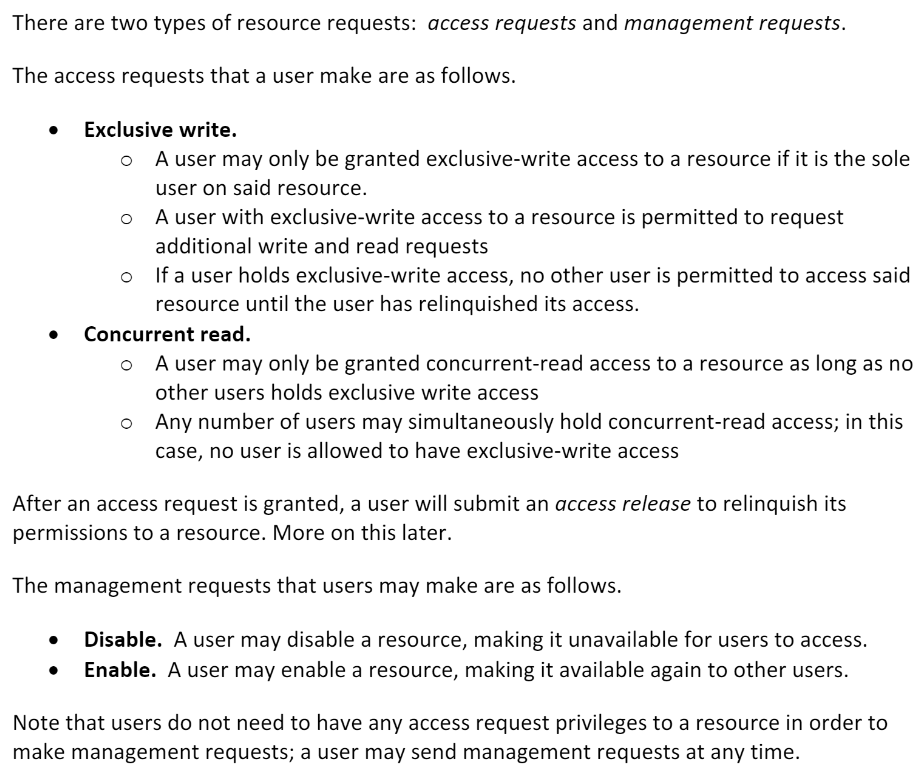
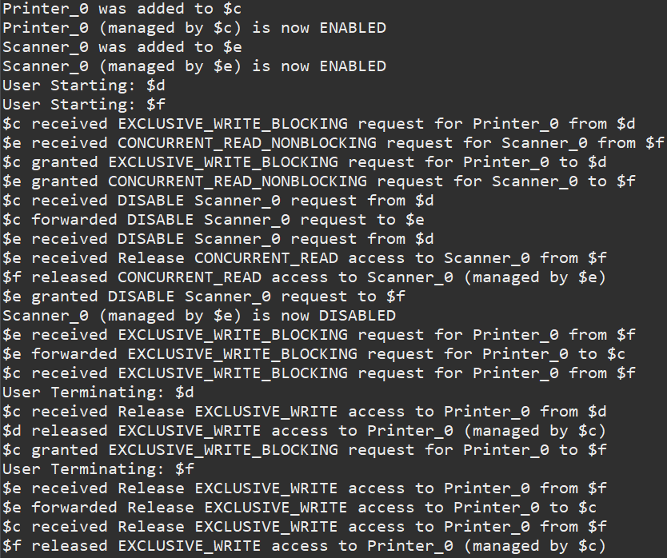

# Java-Akka-Distributed-Resource-System
## Functionality:
The "resources" being managed are simple classes uniquely identified by strings. These resources do not do any real work in this simulation, but the ResourceManagerActor handles overlapping requests to simulate accessing/releasing these abstracted resources to demonstrate a simulated distributed system. The resources simply ask for access then release their access, but there are various variants of access requests such as blocking, non-blocking, read, write, etc. There is also a discovery algorithm for accessing resources in unknown locations, where resource managers ping other managers and to ask if they own the resource. Specific details about the implementation, as well as sequencing diagrams for the request types, can be found in the PDF in the parent directory of this repository. The requests are then logged and printed at the end of the simulation.

The simulation can be run by running the "Main.java" file in the utils directory. The test cases are in the .txt files in the project directory, and you can switch the tests in Main.java as well as edit the .txt files to test other simulations than provided.

### Quick Summary:
ResourceManagers are in charge of managing simulated resources such as printers and scanners for simulated users. ResourceManagers can receive requests from their users for resources that are managed by other ResourceManagers within the distributed system simulation, and must manage communicating between these other ResourceManagers in order to give their users access.
  

## Sample Output:
Here is a quick screenshot of what a simluation looks like (this one is using setupTest3() in Main.java)
  
